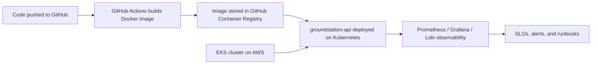

## 🛰️ Space SRE Lab  
A hands-on Site Reliability Engineering platform demonstrating how to design, deploy, and operate mission-critical cloud infrastructure using **Terraform**, **EKS**, **Kubernetes**, **CI/CD**, and **modern observability practices**.  

This repo mirrors what real SREs do every day: build reliable systems, automate everything, measure service health using SLOs, and create operational tooling that supports fast, safe deployments.

---

## ✨ What This Project Demonstrates  
**This lab is structured as an end-to-end, production-style SRE environment. It shows I can:**

### 🚀 Cloud & Infrastructure Engineering  
- Provision AWS infrastructure (VPC, private subnets, IAM roles, EKS cluster, node groups) using **Terraform**  
- Design multi-AZ, privately-networked Kubernetes environments  
- Understand cloud networking, IAM, scaling, and deployment patterns  

### 🔄 DevOps & CI/CD  
- Build CI pipelines using **GitHub Actions**  
- Build, tag, and publish container images to **GitHub Container Registry (GHCR)**  
- Prepare for GitOps-style deployment workflows (Kubernetes manifest-ready)

### 📦 Kubernetes Platform Engineering  
- Deploy containerized microservices to Kubernetes  
- Configure health probes, autoscaling (HPA), and operational annotations  
- Manage multi-environment deployment patterns  

### 📊 Observability & SRE Practices  
- Instrument workloads with Prometheus metrics (`/metrics`)  
- Produce dashboards (Grafana-ready), logs (Loki-ready), and service-level indicators (SLIs)  
- Write SLOs, alert policies, and runbooks for incident response  
- Align with Google SRE principles (error budgets, burn rates, reliability vs velocity)

---

## 🧠 Why This Project Matters  
Hiring managers aren’t just looking for someone who “used AWS” or “ran a Kubernetes cluster.”  
They want someone who can design a system, automate it, instrument it, deploy it safely, and keep it reliable.

This project shows that I can:

- Think like an **SRE**  
- Build like a **Platform Engineer**  
- Operate like a **DevOps Engineer**  
- Communicate like a **Senior Engineer**

It represents real-world abilities, not toy examples.

---

## 🧪 Core Technologies  
| Area | Tools / Tech |
|------|--------------|
| **Cloud** | AWS (VPC, EKS, IAM, EC2, subnets) |
| **IaC** | Terraform (modular VPC + EKS) |
| **Containers** | Docker, GHCR |
| **Orchestration** | Kubernetes (Deployments, Service, HPA) |
| **CI/CD** | GitHub Actions |
| **Observability** | Prometheus, Grafana, Loki/Vector |
| **SRE Ops** | SLIs/SLOs, Error Budgets, Runbooks |

---

## 🚀 Space SRE Platform Architecture

It includes:

- **Groundstation API** – a FastAPI-based demo service that simulates a satellite/groundstation
  telemetry endpoint. It exposes:
  - `/healthz` – readiness probe
  - `/livez` – liveness probe
  - `/telemetry` – simulated telemetry calls with variable latency
  - `/metrics` – Prometheus-compatible metrics for requests and latency
- **Kubernetes manifests** (`k8s/`) to run the service on a cluster:
  - Namespace: `groundstation`
  - Deployment with probes and resource requests/limits
  - Service (ClusterIP)
  - Horizontal Pod Autoscaler (HPA) scaling between 3–8 replicas
- **Skeletons for SRE capabilities**:
  - Terraform-based AWS infrastructure (`infra/terraform`)
  - Observability stack configuration for Prometheus, Grafana, Loki, Vector (`observability/`)
  - Service Level Objectives (SLOs) (`slo/`)
  - Runbooks for incident response (`runbooks/`)
  - CI/CD configuration (`ci-cd/`)
  - Utility scripts (`scripts/`)

The goal of this repo is to demonstrate how I approach SRE work end-to-end:
from application instrumentation and Kubernetes deployment to observability, SLOs, and operational runbooks
for mission-critical systems such as groundstation or satellite communication services.

---

## 📡 Observability Layer (Metrics, Logs, Dashboards, SLOs)

A mission-critical system—especially one modeled after satellite or groundstation communications—must be observable.  
This lab includes a structured observability layer built around **Prometheus**, **Grafana**, **Loki**, and **Vector**, with SLO-driven alerting to reflect real SRE practices.

### 🔎 Metrics (Prometheus)
Prometheus scrapes the `groundstation-api` at `/metrics`, collecting:
- Request rate (RPS)
- Error rate by status class
- Latency histograms (p50 / p90 / p95 / p99)
- Saturation indicators such as CPU & memory (if running on Kubernetes)

Configuration:  
`observability/prometheus/prometheus.yml`

Prometheus rules include:
- SLI calculations (success rate, latency objectives)
- Burn-rate alert examples for error budgets

Rules:  
`observability/prometheus/rules/groundstation-slo-rules.yml`

### 📊 Dashboards (Grafana)
Grafana dashboards visualize the core **Golden Signals**:
- Latency
- Traffic
- Errors
- Saturation

Dashboard JSON:  
`observability/grafana/dashboards/groundstation-api.json`

This shows how I would define dashboards as code (DaC) in a real team environment.

### 📜 Logs (Loki + Vector)
Vector acts as the log collector/forwarder and ships structured logs to Loki.  
Logs are enriched with service metadata for easier correlation during incidents.

- Vector config: `observability/vector/vector-config.yaml`  
- Loki storage/index config: `observability/loki/loki-config.yaml`

This mirrors modern logging architectures used in Kubernetes clusters.

### 🎯 SLOs, SLIs, Error Budgets
To model real SRE operational practices, this lab includes:
- **SLIs**: request success ratio, latency under threshold
- **SLOs**: e.g., 99% success rate, p95 latency < 500ms
- **Burn-rate alerts**: short-window & long-window detection
- **Annotations** describing debugging guidance

This demonstrates not just how to collect metrics, but how to **convert them into business-relevant reliability targets**.

### 🛠 Incident Readiness
SLO alerting ties into runbook-style operator guidance:
- What to check first
- How to verify API health
- How to interpret dashboards
- How to correlate logs + metrics

This shows an understanding of **operational readiness**, not just tooling.

---

This observability layer is intentionally designed to be deployable in stages—first locally, then onto Kubernetes—mirroring real SRE workflows for gradual, low-risk adoption.

## Repo Structure

- `groundstation-api/` – application code + Dockerfile
- `k8s/` – Kubernetes Deployment, Service, HPA, Namespace
- `infra/` – (to be expanded) Terraform for AWS VPC/EKS and related infra
- `observability/` – Prometheus/Grafana/Loki/Vector configuration samples
- `slo/` – SLO definitions for key user journeys
- `runbooks/` – operational procedures for common failure modes
- `ci-cd/` – pipelines for build/publish/deploy
- `scripts/` – helper scripts (e.g., SLO checks)

This is not meant to be production-ready, but to be a conversation starter in interviews
about tradeoffs, design choices, and how I would extend and harden a real-world SRE platform.
