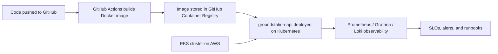

## 🛰️ Space SRE Lab 
## 🎤 TL;DR for Hiring Managers (60 seconds)

This repository is a **learning-focused SRE lab** that demonstrates how I design, deploy, observe, and operate reliable cloud-native systems.

If you only have a minute:
- **Application**: FastAPI “groundstation-api” simulating telemetry traffic with health checks and Prometheus metrics
- **CI/CD**: GitHub Actions builds and publishes container images to GHCR
- **Infrastructure**: Terraform-modeled AWS VPC + EKS (plan-only, interview-safe)
- **Platform**: Kubernetes deployments, probes, autoscaling (HPA)
- **Observability**: Prometheus, Grafana dashboards, Loki logs, SLIs/SLOs
- **Operations**: Realistic runbooks, rollback procedures, and post-incident review template

🎯 **Purpose**: Showcase SRE thinking — not just tools, but reliability tradeoffs, failure handling, and operational readiness.

📄 **3-Minute Guided Walkthrough (PDF)**  
👉 [Space SRE Lab — Interview Walkthrough](./Space_SRE_Lab_3_Minute_Interview_Walkthrough.pdf)

A hands-on Site Reliability Engineering platform demonstrating how to design, deploy, and operate mission-critical cloud infrastructure using **Terraform**, **EKS**, **Kubernetes**, **CI/CD**, and **modern observability practices**.  

This repo mirrors what real SREs do every day: build reliable systems, automate everything, measure service health using SLOs, and create operational tooling that supports fast, safe deployments.

---
## 🎙️ Project Walkthrough & Discussion Guide

Below are structured talking points I use to explain this project at different depths,
depending on the interview format and time available.

---

### ⏱️ 30-Second Overview (Recruiter / Intro Screen)

“This is a learning-focused SRE lab where I model how I’d design and operate a
mission-critical cloud-native service. It includes a FastAPI workload on Kubernetes,
CI/CD with GitHub Actions, Terraform-modeled AWS infrastructure, and a full observability
and incident response layer with SLIs, SLOs, and runbooks.”

---

### ⏱️ 90-Second Technical Summary (Hiring Manager)

“At the center is a containerized FastAPI service that simulates telemetry traffic.
It’s deployed to Kubernetes with health probes, autoscaling, and resource limits.

Infrastructure is modeled using Terraform with clean module boundaries for VPC and EKS.
The environment is intentionally plan-only so reviewers can inspect design without
provisioning resources.

The service is instrumented around the Golden Signals using Prometheus metrics,
Grafana dashboards, and Loki logs. I define SLIs and SLOs and include burn-rate alert
examples, along with realistic runbooks for incidents, rollbacks, and traffic spikes.”

---

### 🔍 Deep Dive (Senior / Onsite / System Design)

“This project is less about the tools and more about how I think about reliability.

I start with clear service boundaries and instrumentation before deployment.
I design CI/CD for safe, repeatable delivery.
I model infrastructure as code so changes are reviewable and auditable.
I define SLOs first and let them drive alerting decisions.
And I document failure modes with runbooks and post-incident review templates.

In interviews, I like to discuss tradeoffs — for example, what I’d harden for production,
how I’d scale observability, or how I’d evolve this into a multi-region system.”

---

### 💡 Common Follow-Ups I’m Ready to Answer

- How would you make this production-ready?
- How would you scale this to multiple regions?
- What SLOs would you choose and why?
- How do you prevent alert fatigue?
- How would you handle a cascading failure?
- What would you automate next?

This project is intentionally designed to support those conversations.

## ✨ What This Project Demonstrates  
**This lab is structured as an end-to-end, production-style SRE environment. It shows I can:**

### 🚀 Cloud & Infrastructure Engineering  
- Provision AWS infrastructure (VPC, private subnets, IAM roles, EKS cluster, node groups) using **Terraform**  
- Design multi-AZ, privately-networked Kubernetes environments  
- Understand cloud networking, IAM, scaling, and deployment patterns  

### 🔄 DevOps & CI/CD  
- Build CI pipelines using **GitHub Actions**  
- Build, tag, and publish container images to **GitHub Container Registry (GHCR)**  
- Prepare for GitOps-style deployment workflows (Kubernetes manifest-ready)

### 📦 Kubernetes Platform Engineering  
- Deploy containerized microservices to Kubernetes  
- Configure health probes, autoscaling (HPA), and operational annotations  
- Manage multi-environment deployment patterns  

### 📊 Observability & SRE Practices  
- Instrument workloads with Prometheus metrics (`/metrics`)  
- Produce dashboards (Grafana-ready), logs (Loki-ready), and service-level indicators (SLIs)  
- Write SLOs, alert policies, and runbooks for incident response  
- Align with Google SRE principles (error budgets, burn rates, reliability vs velocity)

---

## 🧠 Why This Project Matters  
Hiring managers aren’t just looking for someone who “used AWS” or “ran a Kubernetes cluster.”  
They want someone who can design a system, automate it, instrument it, deploy it safely, and keep it reliable.

This project shows that I can:

- Think like an **SRE**  
- Build like a **Platform Engineer**  
- Operate like a **DevOps Engineer**  
- Communicate like a **Senior Engineer**

It represents real-world abilities, not toy examples.

---

## 🧪 Core Technologies  
| Area | Tools / Tech |
|------|--------------|
| **Cloud** | AWS (VPC, EKS, IAM, EC2, subnets) |
| **IaC** | Terraform (modular VPC + EKS) |
| **Containers** | Docker, GHCR |
| **Orchestration** | Kubernetes (Deployments, Service, HPA) |
| **CI/CD** | GitHub Actions |
| **Observability** | Prometheus, Grafana, Loki/Vector |
| **SRE Ops** | SLIs/SLOs, Error Budgets, Runbooks |

---

## 🚀 Space SRE Platform Architecture

```mermaid
flowchart LR
  A[Code pushed to GitHub]
  B[GitHub Actions builds Docker image]
  C[Image stored in GitHub Container Registry]
  D[EKS cluster on AWS]
  E[groundstation-api deployed on Kubernetes]
  F[Prometheus / Grafana / Loki observability]
  G[SLOs, alerts, and runbooks]

  A --> B
  B --> C
  C --> E
  D --> E
  E --> F
  F --> G
```

It includes:

- **Groundstation API** – a FastAPI-based demo service that simulates a satellite/groundstation
  telemetry endpoint. It exposes:
  - `/healthz` – readiness probe
  - `/livez` – liveness probe
  - `/telemetry` – simulated telemetry calls with variable latency
  - `/metrics` – Prometheus-compatible metrics for requests and latency
- **Kubernetes manifests** (`k8s/`) to run the service on a cluster:
  - Namespace: `groundstation`
  - Deployment with probes and resource requests/limits
  - Service (ClusterIP)
  - Horizontal Pod Autoscaler (HPA) scaling between 3–8 replicas
- **Skeletons for SRE capabilities**:
  - Terraform-based AWS infrastructure (`infra/terraform`)
  - Observability stack configuration for Prometheus, Grafana, Loki, Vector (`observability/`)
  - Service Level Objectives (SLOs) (`slo/`)
  - Runbooks for incident response (`runbooks/`)
  - CI/CD configuration (`ci-cd/`)
  - Utility scripts (`scripts/`)

The goal of this repo is to demonstrate how I approach SRE work end-to-end:
from application instrumentation and Kubernetes deployment to observability, SLOs, and operational runbooks
for mission-critical systems such as groundstation or satellite communication services.

---

## 📡 Observability Layer (Metrics, Logs, Dashboards, SLOs)

A mission-critical system—especially one modeled after satellite or groundstation communications—must be observable.  
This lab includes a structured observability layer built around **Prometheus**, **Grafana**, **Loki**, and **Vector**, with SLO-driven alerting to reflect real SRE practices.

### 🔎 Metrics (Prometheus)
Prometheus scrapes the `groundstation-api` at `/metrics`, collecting:
- Request rate (RPS)
- Error rate by status class
- Latency histograms (p50 / p90 / p95 / p99)
- Saturation indicators such as CPU & memory (if running on Kubernetes)

Configuration:  
`observability/prometheus/prometheus.yml`

Prometheus rules include:
- SLI calculations (success rate, latency objectives)
- Burn-rate alert examples for error budgets

Rules:  
`observability/prometheus/rules/groundstation-slo-rules.yml`

### 📊 Dashboards (Grafana)
Grafana dashboards visualize the core **Golden Signals**:
- Latency
- Traffic
- Errors
- Saturation

Dashboard JSON:  
`observability/grafana/dashboards/groundstation-api.json`

This shows how I would define dashboards as code (DaC) in a real team environment.

### 📜 Logs (Loki + Vector)
Vector acts as the log collector/forwarder and ships structured logs to Loki.  
Logs are enriched with service metadata for easier correlation during incidents.

- Vector config: `observability/vector/vector-config.yaml`  
- Loki storage/index config: `observability/loki/loki-config.yaml`

This mirrors modern logging architectures used in Kubernetes clusters.

### 🎯 SLOs, SLIs, Error Budgets
To model real SRE operational practices, this lab includes:
- **SLIs**: request success ratio, latency under threshold
- **SLOs**: e.g., 99% success rate, p95 latency < 500ms
- **Burn-rate alerts**: short-window & long-window detection
- **Annotations** describing debugging guidance

This demonstrates not just how to collect metrics, but how to **convert them into business-relevant reliability targets**.

### 🛠 Incident Readiness
SLO alerting ties into runbook-style operator guidance:
- What to check first
- How to verify API health
- How to interpret dashboards
- How to correlate logs + metrics

This shows an understanding of **operational readiness**, not just tooling.

---

This observability layer is intentionally designed to be deployable in stages—first locally, then onto Kubernetes—mirroring real SRE workflows for gradual, low-risk adoption.

---

## 🧪 Validated Reliability Exercise

A controlled CPU saturation exercise was executed against the Groundstation API on a local Docker Desktop Kubernetes cluster to validate real HPA behavior.

Observed behavior:

- Healthy baseline: **3 replicas**
- HPA CPU target: **60%**
- Sustained CPU pressure triggered automatic scale-out: **3 → 5 → 8 replicas**
- **8 replicas** was the configured maximum
- After load removal, the HPA automatically recovered: **8 → 3 replicas**
- Final application state: **3/3 Ready**, **0 restarts**
- Kubernetes Metrics Server supplied the resource metrics used by the HPA

The exercise also included troubleshooting a missing Resource Metrics API before validation. The diagnosis, local Metrics Server remediation, HPA events, recovery evidence, and operational findings are documented in:

`runbooks/incidents/incident-001-cpu-saturation.md`

> The validated exercise ran locally on Docker Desktop Kubernetes. The AWS VPC/EKS infrastructure in `infra/terraform/` is Terraform-modeled infrastructure and is not presented as the runtime environment for this test.

---

## 🧰 Operations (Runbooks & Postmortems)

This repo includes lightweight operational docs written in the style used by SRE/on-call teams.

### Runbooks
- Incident Response: `runbooks/incident-response.md`
- High Latency: `runbooks/high-latency-groundstation.md`
- Pod CrashLoop: `runbooks/pod-crashloop.md`
- Deployment Rollback: `runbooks/deployment-rollback.md`
- Service Outage: `runbooks/groundstation-outage.md`

### Postmortems
- PIR Template: `postmortems/PIR-template.md`

> Note: Runbook commands assume access to a Kubernetes cluster with kubeconfig configured.
> In this lab, they are provided for interview discussion and operational design review.

## Repo Structure

- `groundstation-api/` – application code + Dockerfile
- `k8s/` – Kubernetes Deployment, Service, HPA, Namespace
- `infra/` – (to be expanded) Terraform for AWS VPC/EKS and related infra
- `observability/` – Prometheus/Grafana/Loki/Vector configuration samples
- `slo/` – SLO definitions for key user journeys
- `runbooks/` – operational procedures for common failure modes
- `ci-cd/` – pipelines for build/publish/deploy
- `scripts/` – helper scripts (e.g., SLO checks)

This is not meant to be production-ready, but to be a conversation starter in interviews
about tradeoffs, design choices, and how I would extend and harden a real-world SRE platform.
